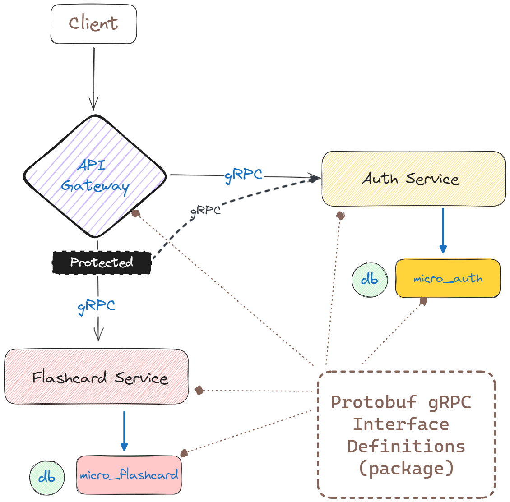

# Protofiles for Soora Spaced Repetition Test

This repository defines protofiles the following microservices:

- auth
- flashcard

## Microservice Flow



Usage:

```json
// package.json
...
"dependencies": {
  ...
  "soora-sr-proto": "git+https://github.com/abulhuman/soora-sr-proto.git",
  ...
}
...
```

```ts
// index.ts
// gRPC config object for auth microservice
{
    // ...
    protoPath: 'node_modules/soora-sr-proto/proto/auth.proto',
    // ...
}
```

Author:

- [Adem Mohammed](abulhuman.dev@gmail.com)

